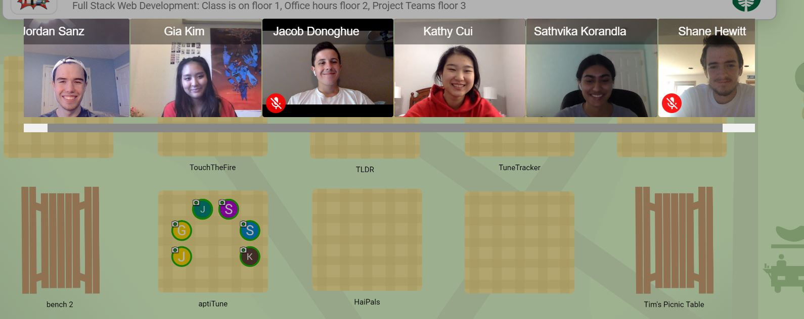

# aptiTune

*Hi! We're AptiTune. Come learn music with us!*

## Description

*AptiTune* is an interactive, sheet-music learning experience. Ever felt like sheet music was too difficult? That you had to be born the perfect Beethoven to do anything with music? *AptiTune* can fix that. 

*AptiTune* introduces exciting, live, and dynamic lessons that utilize multiple game modes while still teaching you content. There's badges to win, stats to see, and quizzes to test your knowledge. Learn all about sheet music in a fun and new way.

*AptiTune* features many different types of lessons. The first is a simple, fill-in-the-blank exercise. It shows a snippet of sheet music, and asks the user to identify the notes on the staff. The second is a listening exercise that plays a piece of music, and asks the user to identify which snippet of sheet music is being played. The third is a rhythm-testing activity that has the user follow a beat by pressing the spacebar at the right rhythm. The final activity type is a pitch-matching activity, in which the user matches the pitches of a given piece of sheet music. 

Currently, *AptiTune* has 4 lessons. Pitch I and II both teach about the notes on the treble clef; Rhythm 1 teaches basic quarter and half notes; and Quiz 1 tests on rhythm and pitch.

*AptiTune* keeps track of stats for you, so you can know when you're making real progress. We keep track of how you do on your quizzes, how many questions you've gotten right, how often you're using the web-app, and where your strong-suits are. *AptiTune* also awards badges when the user is doing well, keeping track of these badges in a badge library on the profile page. The profile page also features a selection of five icons and changing the user's display name.

## Architecture

*AptiTune* is a react-redux based web-app, built using the react.js framework. It has both a front-end and back-end component, and pulls from images stored in AWS. It is built with a series of components, styled with sass. Features on the front-end include the structuring for the sign-in and sign-up pages, as well as the profile, home, and lesson pages. The front-end also holds information about the current lesson, including every one of its pages and the content and activities on each page. 

Lessons in *AptiTune* feature many different packages. 
The fill-in-the-blank lesson uses the *flat.io* API, pulling created sheet music to show the user.
The pitch matching lesson uses many different packages and APIs. It first takes in media from the user using the *WebAudioAPI*. Then, it converts this audio into a WAV file with the *wav-decoder* package. It takes this and uses the *pitchFinder* package to determine the pitches input by the user, and then it passes those pitches to the *EasyScore* package to convert the pitches into sheet music.

### React Tree: 
- App
  - HomePageWithNoUser
  - LessonList
  - CompletedList
  - DrawStaff
  - errorMessage
  - privateRoute
  - NavBar
  - ProfilePage
  - QuizList
  - SignIn
  - HomePageWithUser
  - Lesson:
    - Page
    - FinishedLesson
    - Activities:
      - FlatView
      - Listening
      - ListeningAnswer
      - RhythmSensor
      - SingNotes

## Setup

To set-up, simply run `yarn install`. 

## Deployment

*AptiTune* is live on this site:
[frontend](http://aptitune.surge.sh/signup)

## Authors

Jacob Donoghue  
Kathy Cui  
Jordan Sanz  
Sathvi Korandla  
Gia Kim  
Shane Hewitt  

## Acknowledgments

We'd like to thank Tim Tregubov for teaching us how to make a web app in 10 weeks. We'd also like to thank every react package author who writes a lot of documentation. You are the best. 

